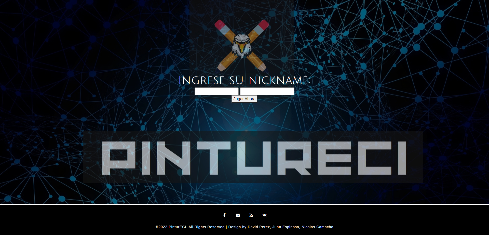
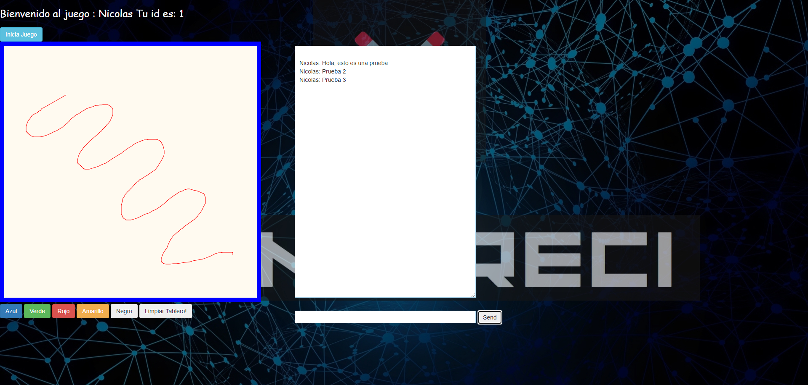

# Pintureci

## Authors

* [David Pérez](https://github.com/DavidPZ666)
* [Juan Espinosa](https://github.com/Juancode-Espi)
* [Nicolas Camacho](https://github.com/haatom)

## Deployed 

## Introducción

Se realizará una adaptación del famoso juego online pinturillo en el que los jugadores dibujan para acertar una palabra y así ganar puntos. Nuestra versión estará adaptada a nuestra comunidad universitaria  en las que competirán  los diferentes programas  de pregrado de la Escuela Colombiana de Ingeniería con añadidos de juego en equipo y diferentes powers ups.

## Descripción

- Pantalla de inicio: Existe una pantalla de inicio en la cual el usuario podrá seleccionar un nombre de usuario (que no es único es decir en otra partida podrá ser seleccionado por otro usuario) , también podrá seleccionar un avatar (una imagen o dejar una por defecto), luego seleccionara un equipo en los que se encontraran las diferentes carreras de pregrado de la escuela, una vez los jugadores estén listos y han personalizado sus jugadores se dará inicio al juego.
- Pantalla de juego: Una vez iniciada la ronda se mostrará el tablero de dibujo, adicionalmente se muestra el chat donde los jugadores podrán escribir concurrentemente, mientras el equipo que tenga el turno de dibujar podrá dibujar simultáneamente.
- Puntuación: Las rondas tendrán de duración de 90 segundos donde mientras un equipo está dibujando los demás equipos intentan adivinar la palabra para ganar puntos. Mientras menos tiempo gasten en adivinar la palabra más puntaje se le otorgara al equipo que haya acertado.
- Power ups: Mientras transcurre la partida los equipos podrán obtener power ups que les darán ventaja o le darán una desventaja al rival. Entre ellos están ocultar pantalla, bloquear chat.
- Pantalla final: Una vez finalizadas las rondas se hará el conteo de puntos por equipo se dará a conocer el equipo ganador. Dando la opción a los jugadores de volver a jugar.

## Sprint 1

Como inicio del proyectó se realizó la implementación básica del juego, en el que se incluye una página de inicio donde el usuario puede realizar su registro para iniciar a jugar, cuando este logra ingresar podrá visualizar la pantalla de juego en la que encontrara la pantalla de dibujo, el chat para interactuar con los demás participantes, su nombre, su id, y la palabra a adivinar en la ronda actual.

- Login del juego: En el que el usuario ingresara su nickname y el identificador que usará en la ronda (en próximos sprint's este uso de identificador cambiará para una interfaz más intuitiva para el usuario).

- Pantalla de juego: En el que el usuario interactuará con el juego, teniendo la pantalla de dibujo si es su turno (con sus respectivos colores, y boton para realizar una limpieza de pantalla), un chat para interactuar con los demás usuarios y/o adivinar la palabra en caso de no estar dibujando, adicional encontrará su nombre e identificador en la parte superior de la pantalla

- Diagrama de componentes: Diagrama explicativo dividido en componentes y aplicaciones usadas en el proyecto mostrando como interactuan entre ellas.

- Diagrama de despliegue: Diagrama explicativo que demuestra la disposición fisica del software usado en el proyecto

- Diagramas de actividades: Diagramas explicativo que representa las actividades realizadas en el proyecto

